<!DOCTYPE html>
<html lang="en">

<body>
    

<h1>Implementing a Method for Predicting the Remaining Life of Turbofan Engine Degradation Using the NASA C-MAPSS Dataset</h1>

This repository contains the implementation of a method to predict the remaining useful life (RUL) of turbofan engines based on the NASA C-MAPSS dataset. The approach is based on the reference paper by Shcherbakov et al., 2022, and includes data preprocessing, model training, and evaluation steps. We implement the network for multiple scenarios: regression and classification. For each scenario, we tried three network architectures: CNN-LSTM, LSTM, and CNN. Additionally, we investigate the effect of using early stopping in each case and demonstrate that early stopping provides better results. 

## Table of Contents

1. [Dataset](#dataset)
2. [Methodology](#methodology)
    1. [Data Preprocessing](#data-preprocessing)
    2. [Model Architectures](#model-architectures)
        - [CNN-LSTM](#cnn-lstm)
        - [LSTM](#lstm)
        - [CNN](#cnn)
    3. [Training and Evaluation](#training-and-evaluation)
        - [Regression](#regression)
        - [Classification](#classification)
        - [Early Stopping](#early-stopping)
3. [Results](#results)
    1. [Regression Results](#regression-results)
    2. [Classification Results](#classification-results)
4. [Conclusion](#conclusion)
5. [References](#references)
6. [Usage](#usage)
    - [Installation](#installation)
    - [Running the Code](#running-the-code)
7. [License](#license)

The goal of this project is to develop an intelligent maintenance system for turbofan engines. By predicting the remaining useful life of these engines, we can plan maintenance activities more effectively, reduce downtime, and improve overall safety.

<h2 id="data-preprocessing">Data Preprocessing</h2>

First, we examine and prepare the dataset. We need to load the dataset:

<pre><code class="python">
import pandas as pd

!pip install gdown

# Downloading and unzipping the dataset
!gdown --id 1uNIreOQ1GWxIu_Aw-YWLT-xobcSWV2Kj -O /content/dataset.zip
!unzip -q /content/dataset.zip -d /content/dataset
!rm /content/dataset.zip
</code></pre>

<h3>Dataset Description</h3>

The dataset used is the Turbofan Engine Degradation dataset from NASA's C-MAPSS collection. This dataset includes sensor outputs from a set of simulated turbofan jet engines. The sensor outputs are recorded as time-series data.

In the training dataset, the engine starts operating normally until a fault occurs, which gradually increases. In the training dataset, this fault escalation continues until failure, after which no data is recorded.

The recorded information includes operational settings of the engines, recorded in 3 columns, and measurements from 21 sensors. This information is recorded for 100 units. However, the recorded data (remaining cycles) before failure in the test set is provided in a separate file because the test data ends before reaching failure.

Overall, the dataset is recorded in 26 columns, which are as follows:

<pre><code>
1) unit number
2) time, in cycles
3) operational setting 1
4) operational setting 2
5) operational setting 3
6) sensor measurement 1
7) sensor measurement 2
...
26) sensor measurement 26

Data Set: FD001
Train trajectories: 100
Test trajectories: 100
Conditions: ONE (Sea Level)
Fault Modes: ONE (HPC Degradation)
</code></pre>

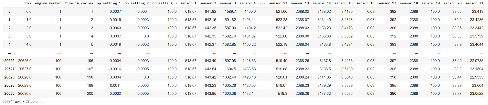

<em>Figure 1: Training dataset before preprocessing.</em>

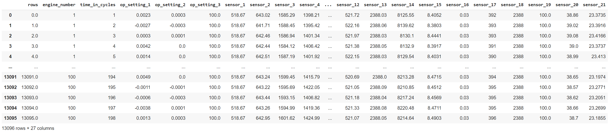

<em>Figure 2: Test dataset before preprocessing.</em>

To work with this dataset, we can read the CSV files as shown below (for convenience we also convert this dataset in CSV file), or use the original text files. We have examined both methods.

<pre><code class="python">
import pandas as pd

# we load the training and test sets
train_df = pd.read_csv('/content/dataset/train_FD001.csv', header=None)
test_df = pd.read_csv('/content/dataset/test_FD001.csv', header=None)
rul_df = pd.read_csv('/content/dataset/RUL_FD001.csv', header=None)

columns = ['rows', 'engine_number', 'time_in_cycles'] + [f'op_setting_{i}' for i in range(1, 4)] + [f'sensor_{i}' for i in range(1, 22)]
train_df.columns = columns
test_df.columns = columns[:3] + [f'op_setting_{i}' for i in range(1, 4)] + [f'sensor_{i}' for i in range(1, 22)]

train_df = train_df.iloc[1:].reset_index(drop=True)
test_df = test_df.iloc[1:].reset_index(drop=True)
</code></pre>

The goal of working with this dataset is to predict the number of operational cycles remaining before failure, as creating a warning system before failure is crucial. Naturally, if the degradation falls below a certain threshold, it indicates failure.

The preprocessing of the dataset includes four steps: Data Selection, Data Normalization, Data Labeling, and Time Windowing.

<h3>Data Selection</h3>

In the Data Selection phase, sensors that do not show significant changes with the increase of the life cycle are removed from the dataset. These sensors do not provide valuable information for determining the Remaining Useful Life (RUL) and only add complexity to the network. According to the reference paper, the following columns are removed: <code>c3</code>, <code>s1</code>, <code>s5</code>, <code>s10</code>, <code>s16</code>, <code>s19</code>. We follow the same approach in this implementation and remove the specified columns, although a few other columns could also be removed.

After applying Data Selection, the training dataset is as shown in Figure 3. The same operations are applied to the test dataset.

<pre><code># we remove the specified columns
columns_to_remove = ['rows', 'op_setting_3', 'sensor_1', 'sensor_5', 'sensor_10', 'sensor_16', 'sensor_19']
train_df.drop(columns=columns_to_remove, inplace=True)
test_df.drop(columns=columns_to_remove, inplace=True)
</code></pre>
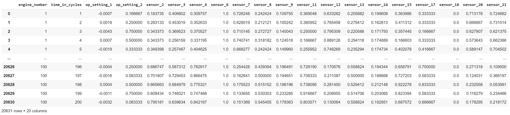

<em>Figure 3: Data Selection applied to the training dataset.</em>

As shown in Figure 3, the specified columns have been removed from the dataset. This process is repeated for the test dataset. Note that the first two columns are not involved in the training process and will be separated in later stages. The same process is applied to the test dataset, and finally, 18 features are selected for training and testing.

If processing directly from the original text file, the corresponding sensor columns are identified and removed based on their indices. The columns to be removed are:

<pre><code>[0, 1, 4, 5, 9, 14, 20, 23]
</code></pre>

Thus, these columns are removed from the dataset. For example, after removing these columns from the test dataset, the following code is used:

<pre><code># Data Selection implementation
engine_time_df = test_df[['engine_number', 'time_in_cycles']].copy()
columns_to_be_dropped1 = [0, 1, 4, 5, 9, 14, 20, 23]

columns_to_be_dropped = ['engine_number', 'time_in_cycles', 'rows', 'op_setting_3', 'sensor_1', 'sensor_5', 'sensor_10', 'sensor_16', 'sensor_19']

test_data_dropped = test_data.drop(columns=columns_to_be_dropped1)
test_df_dropped = test_df.drop(columns=columns_to_be_dropped)
</code></pre>

<h3>Data Normalization</h3>

Since the data is captured from various sensors, they have different ranges. Some sensors may have large measurements while others may have smaller values. Encountering different scales of values (very large or very small) can make the learning process difficult for the network. This can impose unnecessary heavy computations and cause computational saturation in the network, potentially biasing the network towards features with large values. To prevent this, normalization and standardization techniques are used. According to the approach presented in the reference paper, sensor features are initially mapped to the range of 0 to 1 using the following formula.

After Data Selection:

<pre><code>from sklearn.preprocessing import MinMaxScaler

features_to_normalize = train_df.columns[3:]

train_df[features_to_normalize] = train_df[features_to_normalize].apply(pd.to_numeric, errors='coerce')
test_df[features_to_normalize] = test_df[features_to_normalize].apply(pd.to_numeric, errors='coerce')

# we use the min-max-scaler in sklearn lib
scaler = MinMaxScaler()
train_df[features_to_normalize] = scaler.fit_transform(train_df[features_to_normalize])
test_df[features_to_normalize] = scaler.transform(test_df[features_to_normalize])
</code></pre>

After applying Data Normalization, the training dataset is as shown in Figure 2. The same normalization is applied to the test dataset as well.

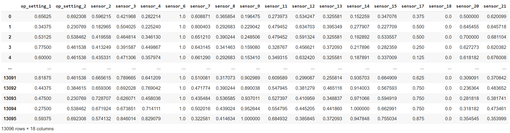

<em>Figure 4: Normalized test dataset.</em>

<em>Figure 5: Normalized training dataset.</em>

<h3>Data Labeling </h3>

Now we need to create labels for each of the datasets.

For the training dataset, we follow the approach outlined in the paper. Initially, we find the maximum cycle for each engine and label it using a piece-wise linear method. This is because the engine remains healthy for a while initially, and its health does not degrade with the increase in cycles. This method provides a more logical and better labeling approach compared to a linear model. As in the paper, the initial constant value is considered to be 130, which is consistent with the nature of the dataset.

<pre><code class="language-python"># Applying min-max-standardization

columns = ['engine_number', 'time_in_cycles'] + [f'op_setting_{i}' for i in range(1, 4)] + [f'sensor_{i}' for i in range(1, 22)]
train_df.columns = columns

max_cycles = train_df.groupby('engine_number')['time_in_cycles'].max().reset_index()

sorted_max_cycles = max_cycles.sort_values(by='engine_number').reset_index(drop=True)
</code></pre>

<pre><code>engine_number  time_in_cycles
0               1             192
1               2             287
2               3             179
3               4             189
4               5             269
..            ...             ...
95             96             336
96             97             202
97             98             156
98             99             185
99            100             200

[100 rows x 2 columns]
</code></pre>

After finding the maximum cycle for each engine, we increase the cycle linearly from the last cycle to the length of the window. After that, we consider its value fixed, equal to the window length (considered from the last to the first). We repeat this process for all units or engines so that all data is labeled.

For example, we label the first engine piece-wise as shown below.

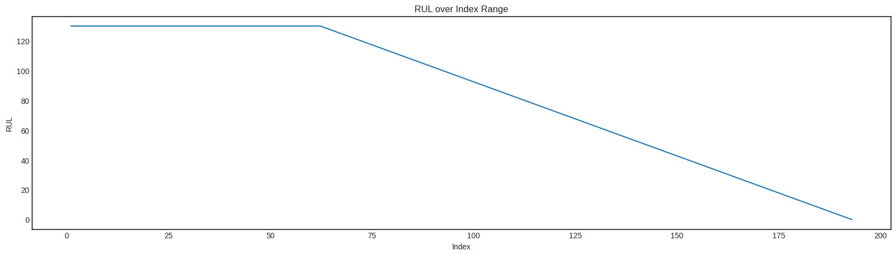

<em>Figure 6: Piece-wise linear labeling for the first.</em>

<pre><code>0      130
1      130
2      130
3      130
4      130
... 
187      4
188      3
189      2
190      1
191      0
Name: RUL, Length: 192, dtype: int64
</code></pre>

For classification, we only need to consider a threshold (e.g., 50 as considered in the paper). Values less than 50 are considered as the Degenerated class and values greater than or equal to 50 are considered as the Not-Degenerated class.

After labeling, the training dataset will look like this:

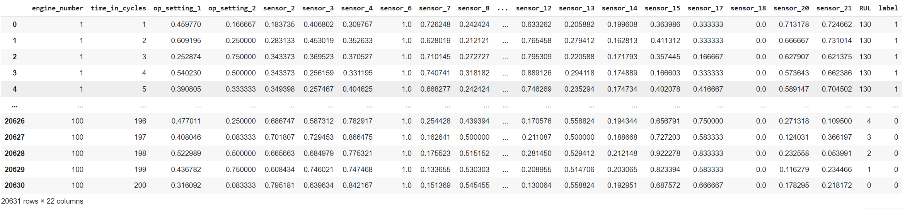

<em>Figure 7: Labeled training datasetLabeled training dataset.</em>

<em>Figure: Labeled training dataset</em>

As seen, the RUL is used for regression and the label derived from RUL is used for classification.

For labeling the test dataset, we first read the RUL labels provided in the attached file.

<pre><code class="language-python"># Reading the actual test labels
RUL_of_correspond_to_each_engin = test_rul_df[1]
RUL_of_correspond_to_each_engin
</code></pre>

<pre><code>0      RUL
1      112
2       98
3       69
4       82
... 
96     137
97      82
98      59
99     117
100     20
Name: 1, Length: 101, dtype: object
</code></pre>

Since the test data ends before reaching the actual last working cycle of each unit, the remaining cycles after the last recorded cycle in the Test-FD001.csv file are specified in the RUL-FD001.csv file.

To calculate the labels for all test data, we consider the actual RUL for the last recorded cycle and increase the life linearly for the previous data until reaching the first recorded data for each engine. The column for Remaining Useful Life is calculated by adding the maximum cycle value to the corresponding values in the RUL-FD001.csv file and then subtracting the cycle column value from each row in the test data.

To implement this pre-processing for the test data, the initial steps are similar to the training data. However, the labeling part differs.

First, we calculate the maximum cycle and add it as a row of data. For example, as shown in the figure below, the maximum cycle is added as a column named Max-time-in-cycle. This value is then subtracted from the Time-in-cycle column, and the result is stored in a column named RUL-x. The actual test labels from the RUL-FD001.csv file are read and concatenated as a column named RUL-y.

The RUL-y column value is then added to the RUL-x column, and the final label for each row of the dataframe is stored in the RUL column.

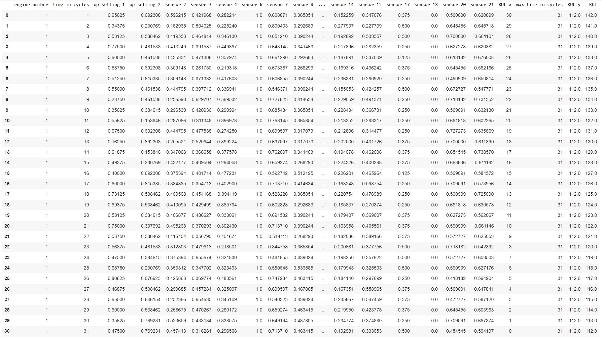

<em>Figure 8: Explaining the labeling and showing it for the first unit.</em>

Next, based on the distribution of the training dataset and its piece-wise linear labeling, we apply similar processing to the test dataset to ensure the labeling method is consistent with the training dataset. A lambda function is used for thresholding with a value of 130 for regression and 50 for classification, as per the reference paper. Values greater than 130 are limited to this value for regression, and for classification, binary labels of 0 and 1 are assigned based on whether they are below or above the RUL value of 50, respectively.

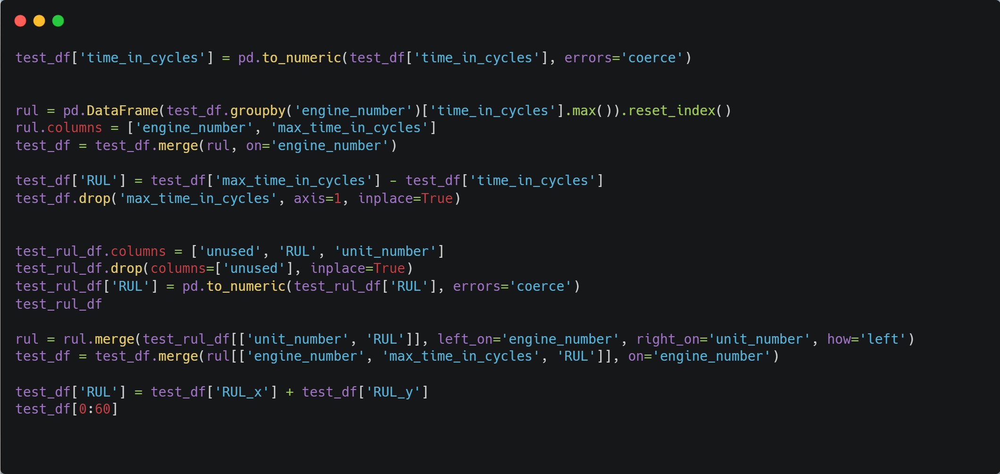

<em>Figure 9: Implementation code for labeling test data.</em>

The thresholding process is shown in the figure below.

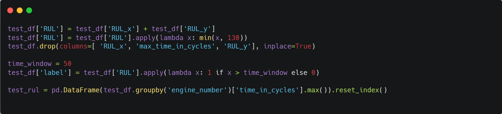

<em>Figure 10: Thresholding for test data (similar for train data).</em>

After thresholding and removing auxiliary columns, the labeled data for the first unit will look like this:

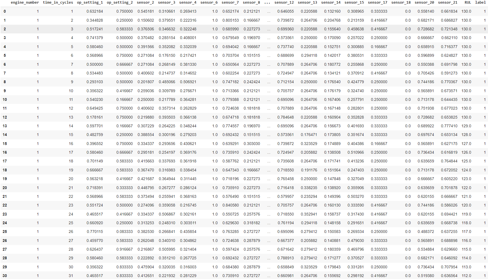

<em>Figure 11: Labeled test data for the first unit as an example.</em>

<h3>Time Windowing</h3>

For processing time signals, we need to generate time windows. We choose windows of length 30 because the window length should be less than the length of the shortest record, and the shortest record in the dataset is 31. According to the paper, each window's step is considered to be 1. We create all windows by iterating through each unit or engine in the outer loop and from the maximum cycle for each engine to the window length in the inner loop. This way, a window of length 30 is created from the last cycle. We slide the window up to include all data, then move to the next engine.

Each window is labeled with the label corresponding to the last data (row) of the window.

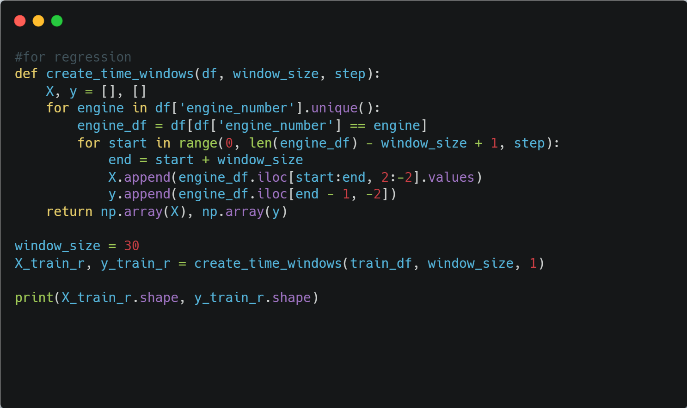

<em>Figure 12: Creating time windows for the training dataset for regression.</em>

This way, time windows are implemented for regression, and the shape of the entire training dataset will be as follows:

<pre><code>Processed training data shape:  (17731, 30, 18)
Processed training targets labels shape:  (17731,)
</code></pre>

For classification, we repeat the mentioned steps, but we use the last column (label) as the label for each window instead of the RUL column.

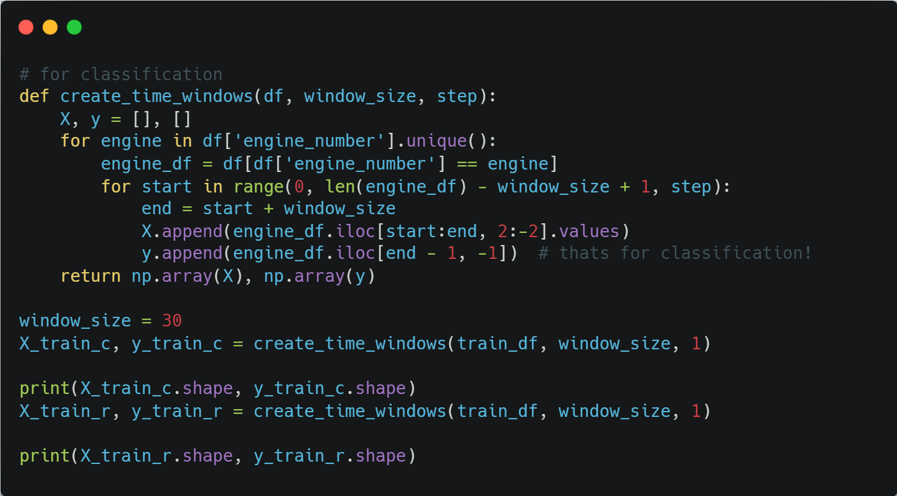

<em>Figure 13: Creating time windows for the training dataset for classification.</em>

Thus, the entire training data is converted into 17731 windows of 30 with 18 features.

The windowing process and code for the test data are identical to the training data windowing. However, for testing, we only consider the last window. In this case, the inner loop is removed, and we only take the last data corresponding to the maximum cycle for a window of length 30. The label is the actual RUL value from the RUL-FD001.csv file for each engine.

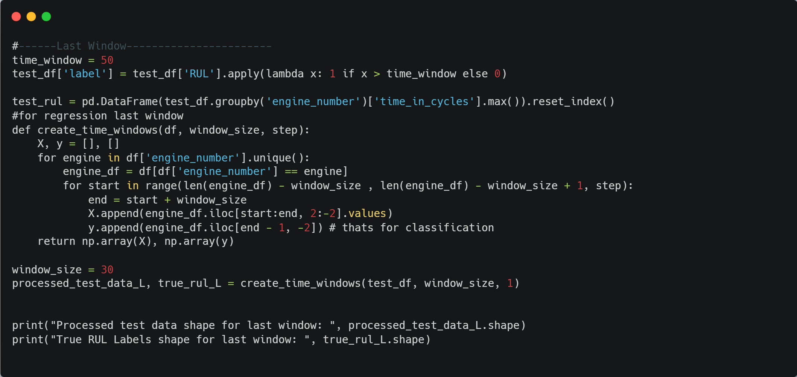

<em>Figure 14: Implementation of windowing based on the last window.</em>

The overall output of the test dataset after windowing will be as follows:

<pre><code>Test size after windowing for all windows :
Processed test data shape for last window:  (100, 30, 18)
True RUL Labels shape for last window:  (100,)

Test size after windowing for last windows :
Processed test data shape:  (10196, 30, 18)
True RUL Labels shape:  (10196,)
</code></pre>

The values obtained for the test and train data match the values mentioned in the paper.

<h3>Model Training - Classification</h3>

In this section, we train the CNN-LSTM model according to the settings described in the reference paper <cite>Shcherbakov2022</cite>. 
First, we ensure that our settings match the paper's settings for training and testing.

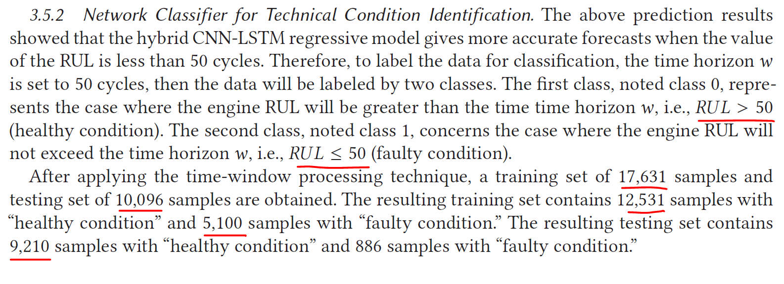

<em>Figure 15: Parameter settings for the classification section in the reference paper<cite>Shcherbakov2022</cite></em>

According to the reference paper, 17631 data points were used for training, and 10096 data points were used for testing. This means that all windows were considered for training and testing, which matches the values obtained in the preprocessing section of this report. Additionally, the number of Faulty condition and Healthy condition labels matches our obtained values (as seen in the confusion matrix).

For all training scenarios, whether for classification or regression, we split 20% of the training dataset for validation.

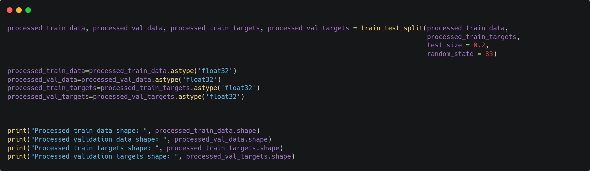

<em>Figure 16: Dataset split<cite>Shcherbakov2022</cite></em>

<pre><code>Processed train data shape:  (14184, 30, 18)
Processed validation data shape:  (3547, 30, 18)
Processed train targets shape:  (14184,)
Processed validation targets shape:  (3547,)
</code></pre>

<h3>First Scenario: Classification with Early-stopping</h3>

First, we implement the optimized CNN-LSTM model described in the paper. All its parameters are implemented exactly as described in the paper (other models and also without early stopping conditions can be seen in the attached .ipynb files.

<pre><code>Model: "sequential_11"
_________________________________________________________________
Layer (type)                Output Shape              Param #   
=================================================================
conv1d_27 (Conv1D)          (None, 26, 32)            2912      
conv1d_28 (Conv1D)          (None, 24, 64)            6208      
max_pooling1d (MaxPooling1  (None, 8, 64)             0         
D)                                                              
lstm_6 (LSTM)               (None, 8, 50)             23000     
dropout_2 (Dropout)         (None, 8, 50)             0         
lstm_7 (LSTM)               (None, 50)                20200     
dropout_3 (Dropout)         (None, 50)                0         
dense_33 (Dense)            (None, 50)                2550      
dense_34 (Dense)            (None, 1)                 51        
=================================================================
Total params: 54921 (214.54 KB)
Trainable params: 54921 (214.54 KB)
Non-trainable params: 0 (0.00 Byte)
_________________________________________________________________
</code></pre>

Then we train the model with the following settings, exactly as in the paper.

In this section we use 100 epochs. Also, the batch size is set to 200, and the learning rate is set to 0.001. The Adam optimizer is used as the optimizer.

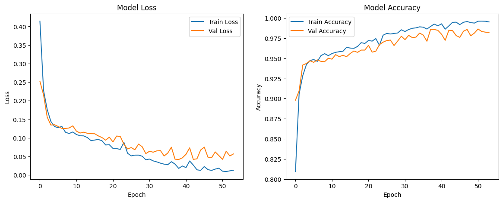

<em>Figure 18: Accuracy and error curves during training</em>

As can be seen, the error and classification curves decrease and increase respectively. Due to the use of Early-Stopping, the training process is halted before the variance increases, which could lead to generalization error or overfitting on the training data. The better performance achieved using this simple technique is evident when comparing the results of this scenario with the previous one (without Early-Stopping).

<pre><code>
    
319/319 [==============================] - 3s 5ms/step
Precision: 0.9769148936170213
Recall: 0.9863587540279269
F1-Score: 0.98161411010155
Accuracy: 0.9662612789329149
precision    recall  f1-score   support

Class 0       0.84      0.76      0.80     886
Class 1       0.98      0.99      0.98     9310

accuracy                          0.97     10196
macro avg     0.91      0.87      0.89     10196
weighted avg  0.97      0.97      0.97     10196

</code></pre>

As can be seen, the model's accuracy and performance increase by approximately one percent compared to the  scenario without Early-Stopping. Additionally, in this case, the model's accuracy, particularly for class 0, improves significantly, and the F1-score exceeds 98%(you can check the codes).

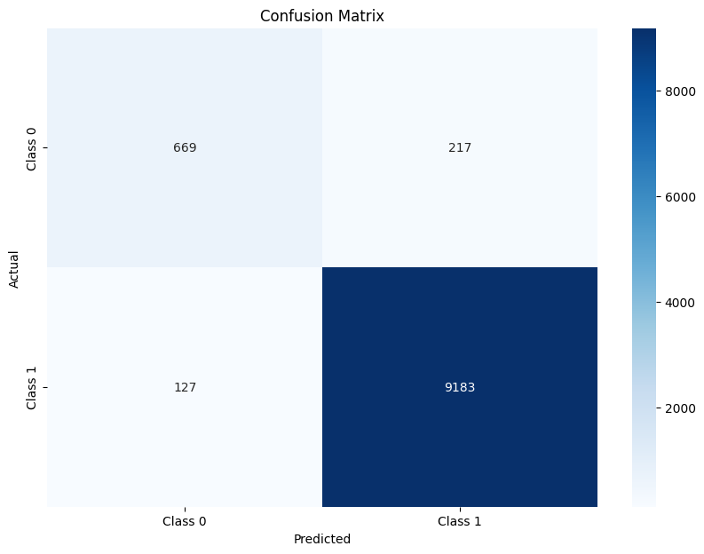

<em>Figure 19: Confusion matrix for CNN-LSTM without Early-Stopping</em>

As seen from the confusion matrix, the algorithm achieved high accuracy on Class 1 and reasonable accuracy on Class 2 (considering the class imbalance). The algorithm effectively differentiates between classes, achieving high accuracy and F1-Score.

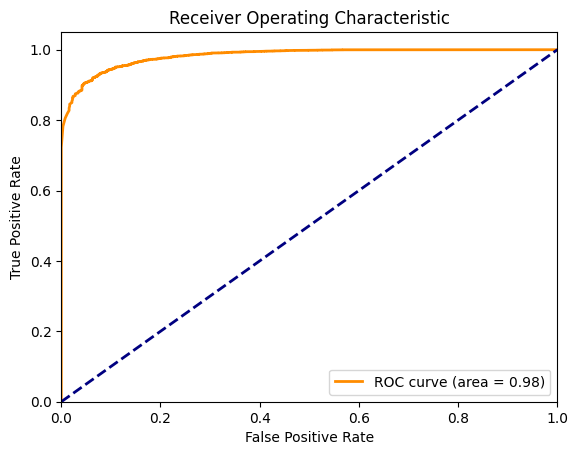

<em>Figure 20: ROC curve for the test dataset</em>

The ROC curve in the figure <em>Figure: ROC curve for the test dataset</em> shows the model's good performance on the test dataset due to the following reasons:

<ul>
  <li><strong>Low False Positive Rate:</strong> The ROC curve is close to the vertical axis, indicating a low false positive rate. This means the model rarely misclassifies negative samples as positive.</li>
  <li><strong>High True Positive Rate:</strong> The ROC curve quickly moves towards the top of the plot, indicating a high true positive rate. This means the model correctly classifies most positive samples.</li>
  <li><strong>Area Under the Curve (AUC):</strong> The AUC is 0.98, indicating excellent model performance. AUC close to 1 means the model can effectively distinguish between positive and negative classes.</li>
  <li><strong>Balance between Sensitivity and Specificity:</strong> The ROC curve shows the model has a good balance between sensitivity and specificity. This balance is important as it indicates the model's ability to not only correctly identify positive samples but also avoid misclassifying negative samples.</li>
</ul>

Given the high area under the ROC curve and its steepness at the beginning, it can be concluded that this algorithm performs well on the dataset, accurately distinguishing between positive and negative samples.

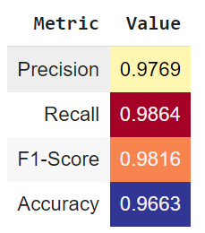

 These results are for considering all of the windows. Additionally, we considered test data as only the last window of data for comparison. As expected, due to the smaller size and potential noise in test data, the accuracy is lower than the previous scenario (implemented out of curiosity, not in the paper due to low accuracy).

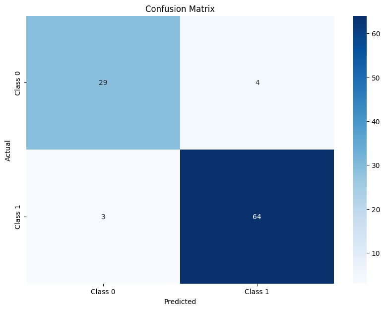

<em>Figure 21: Test accuracy for only the last 100 RUL data points</em>

The metrics for this scenario (for 100 test data points) are shown below:

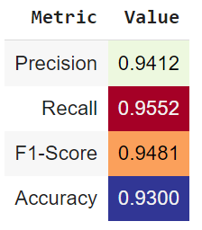

<h2 id="model-implementation">Model Implementation</h2>

The implementation includes training a machine learning model to predict the remaining useful life of the engines based on the preprocessed dataset. The model's performance is evaluated using standard metrics to ensure its accuracy and reliability.

<h2 id="results">Results</h2>

The results section showcases the performance of the implemented model, including accuracy, precision, recall, and other relevant metrics. Visualization of the predictions versus actual remaining life is also provided.

<h2 id="references">References</h2>

<ul>
    <li>Shcherbakov, M., & Sai, C. (2022). A hybrid deep learning framework for intelligent predictive maintenance of cyber-physical systems. ACM Transactions on Cyber-Physical Systems (TCPS), 6(2), 1-22.</li>
</ul>

</body>
</html>

